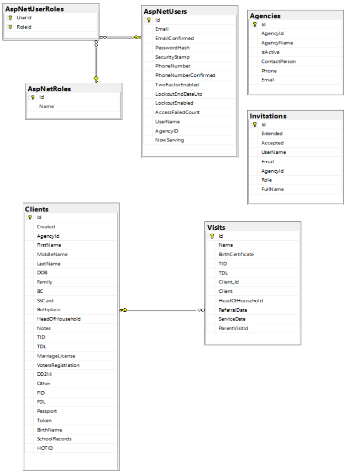

# Database
Eref is a database driven application built using SQL Server technology. In the desktop environment Eref is built using the Sql Server Express database
engine. In the online environment at AppHarbor a full SQL Server is used. The two versions are compatible with each other with respect to the
database features used. SQL Server Management Studio 2016 (SSMS) was used to manage both database engines. In the desktop environment, Windows
Authentication is used to connect to the Sql Server Express database. In the oline enviroment, SQL Server Authentication is used to connect to the 
SQL Server database.

## Connection String
In the desktop environment, SSMS was used to create an empty project database by executing the SQL query

    create database ErefDB
   
The Visual Studio Server Explorer (found under the Eref project View menu) was then used to discover the connection string to database ErefDB by creating
a new Data Connection to it and copying the Connection String property of the data connection as the value of the variable SQLSERVER_CONNECTION_STRING in
the `<appSettings>` section of Web.config. This setting is read programatically by the constructors on IdentityDb.cs and ReferallsDB.cs. See the code
base. Getting the value of the connection string programatically eliminates the need to configure
the connection string in the usual place, the `<connectionStrings>` section of Web.config.
  
The online version of Eref is hosted as an application at AppHarbor and it uses a database server provided as an add-on. The add-on database server
includes a database which serves as the application database, so it is not necessary to create the application database as was done above for the desktop
version.

The connection string of the SQL Server instance at AppHarbor is found under the Configuration Variables section for the Eref application. The 
Configuration Variables section states that the configuration variables should be accessed programatically, since the values may be updated by the
add-on provider without notice. An [AppHarbor knowledge base article](https://support.appharbor.com/kb/add-ons/using-sequelizer) explains that the
connection string is injected as the value of SQLSERVER_CONNECTION_STRING into the `<appSettings>` section of Web.config at application
deploy time. This injection overwrites the statically configured value.

To discover the value of the connection string in the staging and production environments, the SuperadminController was modified to report the value
stored in `<appSettings>`. Each time the Super Admin logs in, the value will be displayed by view ~/Views/Superadmin/Home.cshtml. Knowing this value 
allows a connection to the Eref database to be made through SSMS using SQL Server Authentication. 

Both ELMAH and log4net share the configuration string used by the Eref application. This sharing is accomplished by configurig the connection string
ErefConnectionString on Web.config and setting the connection string alias for the SQL Server add-on at AppHarbor to be ErefConnectionString. When
application Eref is deployed, this alias will overwrite the configured value on file Web.config by the value the connection string for the AppHarbor
database. This is explained in the same knowledge base article referenced above.

## Database Diagram

The 3 tables in the upper left of the above diagram are created by ASP.NET Identity 2.0 to manage registered users of Eref. The 3 tables are managed by
their own data context which cannot be augmented by additional tables. However, data fields can be added to table **AspNetUsers** to connect it to
tables created in a separate data context. This is what has been done for project Eref. The data fields AgencyID and NowServing have been added to table
**AspNetUsers** to connect it to the 4 tables **Agencies**, **Invitations**, **Clients** and **Visits**, which are the data tables used to manage Eref
referrals. These 4 tables are managed by their own data context.

The NowServing field of the **AspNetUsers** table is used to keep track of the client currently being served by an Eref user. The usage of this data
field is explained in the Implementation tab.

The 2 data contexts of project Eref are referred to as IdentityDb and ReferralsDB. (See the section Entity Framework Code First of the Infrastructure
tab.) The technique for establishing a single connection string over 2 data contexts is described in 
[Scott Allen's Pluralsight video](https://app.pluralsight.com/player?author=scott-allen&name=aspdotnet-mvc5-fundamentals-m6-ef6&mode=live&clip=1&course=aspdotnet-mvc5-fundamentals).

The tables in the diagram used to manage Eref referrals were created using a script file. The technique for creating a script file is
described in the *Getting a SQL Script* section of [this article](https://msdn.microsoft.com/en-us/data/jj591621.aspx). This technique is used to keep
the deployd versions of the Eref database in synch with the development version. According to this article, the command

    PM> update-database -ConfigurationTypeName Eref.DataContexts.ReferralMigrations.Configuration -Script -SourceMigration $InitialDatabase
   
will create a script file necessary to create the tables for Eref referrals using all the migrations applied since the initial migration.
  
## Managing Users
Eref is a role based database application administered by a Superadmin. The Superadmin has the responsibilty of establishing a login account for each
Eref user to prevent a user from specifying his/her own role. Most users will be in the role of Client Advocate, which has been established by the 
Superadmin. 

The Superadmin will be given a user name for a new user together with the agency the user works for. For example, if Mary Atwood who works 
for the Salvation Army would like to become an Eref Client Advocate under the user name Mary, this request would be presented to the Superadmin user
at Main Street Ministries. Provided that the user name Mary is not already in use, the Superadmin user would use a private interface to enter Mary
Atwood in the **Invitations** table under UserName Mary with FullName Mary Atwood. Through the private interface the Superadmin would also enter an
email address for Mary and select the Salvation Army as the agency that she represents and select Client Advocate as her role. When saved through the
private interface, this will create a record in the **Invitations** table which is in effect an invitation for Mary Atwood to register under user name
Mary. 
 
The Superadmin will notify Mary that her account has been created and that she may register for its use using user name Mary, the email address she
has provided and a password of her choosing. When Mary registers, the user name and email address she provides will be checked against the
**Invitiations** table. If this pair of identifiers is not found in the **Invitations** table, Mary's attempt to register will be rejected. IF they
are found, a record will be created for her in the **AspNetUsers** table using the password she has specified and using the role
of Client Advocate from the **Invitations** table. The AgencyID field of the created record (obtained from the **Invitations** table) will point to
the record representing the Salvation Army in the **Agencies** table. On subsequent visits to Eref, Mary may simply login with the credentials 
established by her registration. When logged in she will be recognized as a Client Advocate for the Salvation Army and will see only records of clients
served by the Salvation Army.

